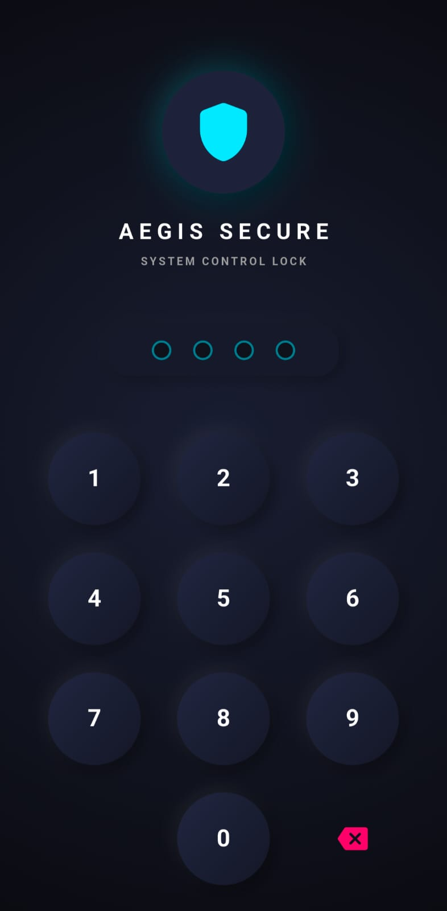
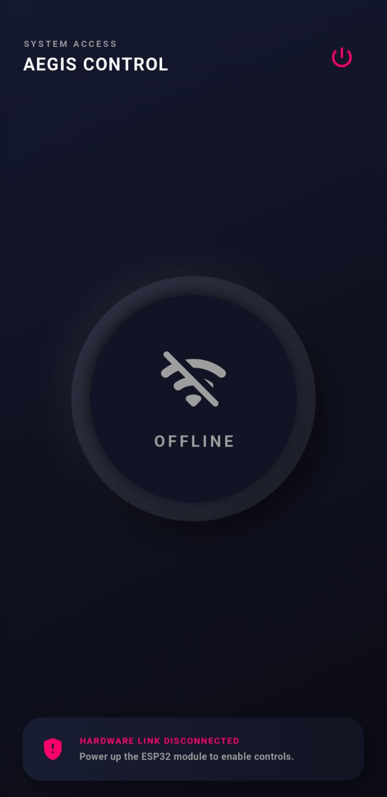
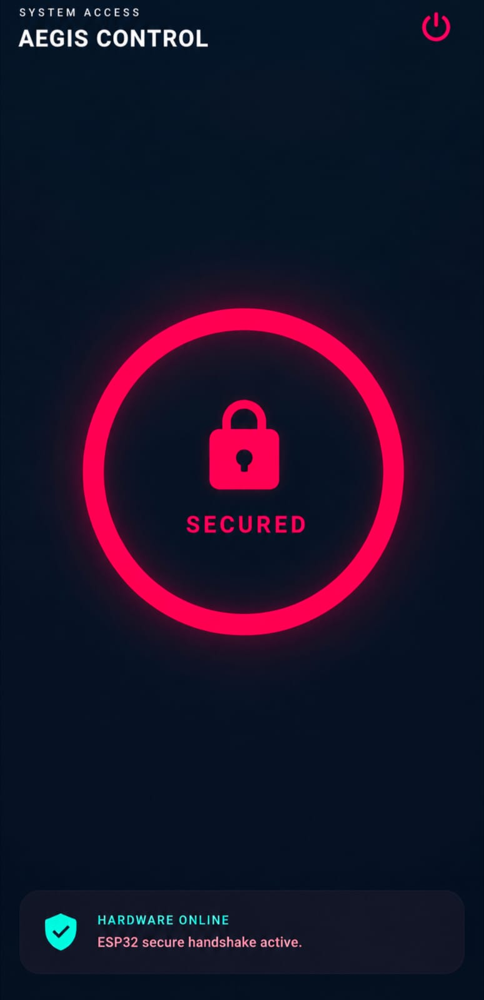
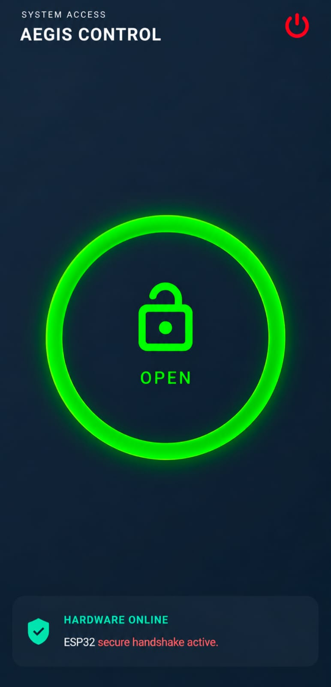
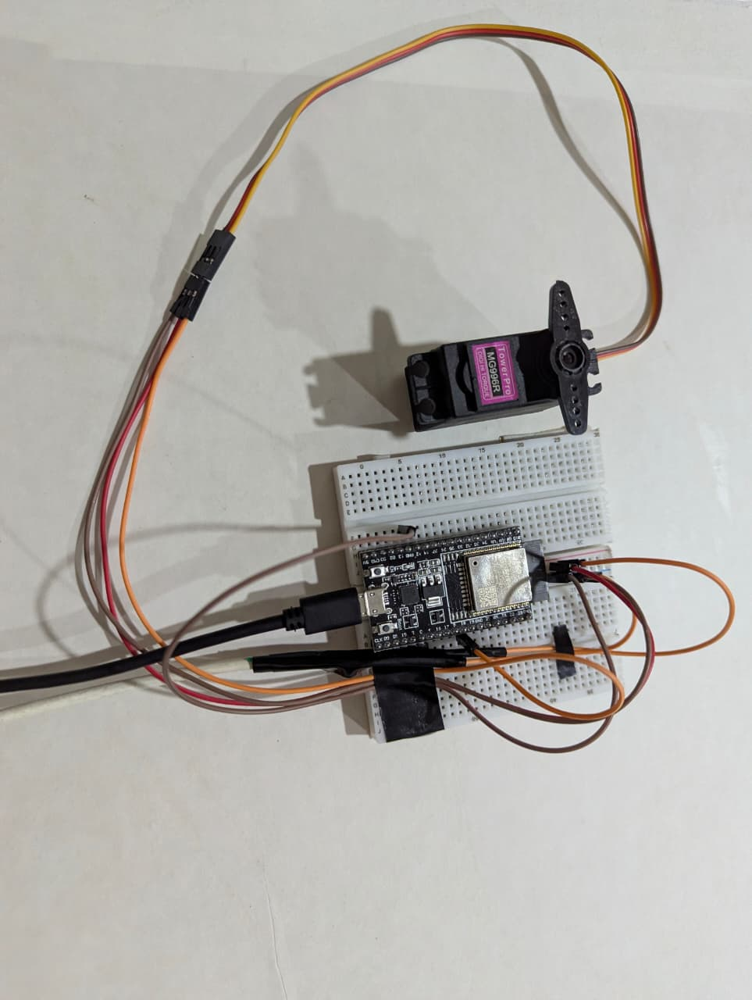
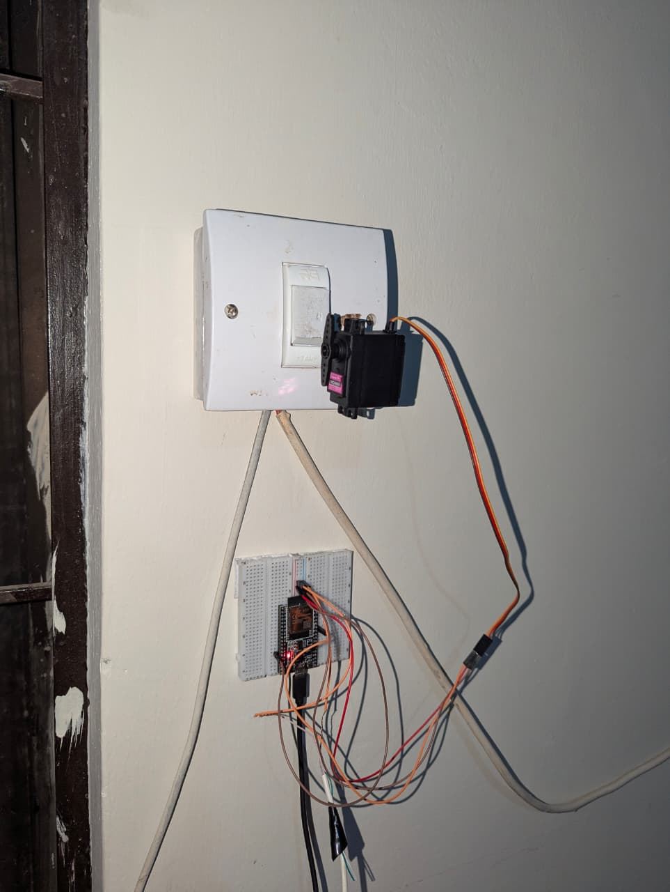

# 🔒 AEGIS – Smart Door Lock System (IoT + Flutter + Firebase)

[](https://flutter.dev/)
[](https://firebase.google.com/)
[](https://www.espressif.com/)
[](https://isocpp.org/)
[](https://opensource.org/licenses/MIT)

AEGIS is an end-to-end IoT-enabled smart door locking system. It allows users to manage and monitor physical door lock status remotely from anywhere in the world using a custom Flutter mobile application, Firebase Realtime Database, and an ESP32 microcontroller.

---

## 🛠️ Tech Stack & Technologies Used

* **Mobile App Framework:** Flutter (Dart)
* **Backend & Cloud Database:** Firebase Realtime Database
* **Microcontroller Firmware:** C / C++ (Arduino Framework for ESP32)
* **Actuation Hardware:** PWM-controlled Servo Motor (SG90 / MG996R) according to your requirement.
* **Version Control:** Git & GitHub

---

## 📱 App Screenshots & Demo Video

<p align="center">
  <a href="https://www.linkedin.com/posts/muhammad-ibrahim0981122_iot-flutter-esp32-activity-7488246161456152576-6dcU?utm_source=share&utm_medium=member_desktop&rcm=ACoAAFi10G8BqTLeCSfjj37EtJ1zmDFp51ti57M" target="_blank">
    
  </a>
</p>

<p align="center">
  
  
  
</p>
<p align="center">
  
  
  
</p>

---

## 🌟 Real-World Use Cases & Applications

* **Smart Home Automation:** Keyless entry for homeowners via smartphone with real-time lock status feedback.
* **Remote Rental Access:** Granting or revoking access remotely for guests without physical key handoffs.
* **Office & Restricted Area Security:** Managing access control for labs, server rooms, or private offices.
* **Accessibility Assistance:** Helping elderly or mobility-impaired individuals unlock doors effortlessly without physical strain.

---

## 🏗️ Repository Structure

```text
AEGIS-Smart-Lock-System/
├── ESP32_Firmware/
│   └── AEGIS_ESP32.ino        # ESP32 C++ Firmware (PWM Servo logic & Firebase connection)
├── lib/                       # Flutter Application source code (UI & Realtime DB integration)
├── android/                   # Android native platform code
├── assets/                    # Project images, screenshots, and icons
└── README.md                   # Complete documentation & setup instructions

```

---

## ⚡ Prerequisites

Make sure you have the following software and hardware components ready before proceeding with the installation.

### 🛠️ Software Requirements

* **Flutter SDK** (v3.x or higher) -> [Install Flutter](https://docs.flutter.dev/get-started/install)
* **VS Code** or **Android Studio** (with Flutter & Dart extensions installed)
* **Arduino IDE** (with ESP32 board manager installed)
* **`ESP32Servo` Library in Arduino IDE:**
* Open Arduino IDE -> `Tools` -> `Manage Libraries...`
* Search for **`ESP32Servo`** and click **Install**.


### 🔌 Hardware Required

* **ESP32 Dev Module**
* **Servo Motor** (SG90 or MG996R)
* **5V External Power Source / Battery** *(Separate power to both ESP32 and motor recommended for stable motor torque)*
* **Jumper Wires & Breadboard**

---

## 📐 Hardware Wiring & Power Guide

Servo motors draw sudden current spikes during rotation, which can cause the ESP32 to trigger brownout resets if powered incorrectly. Follow this step-by-step breadboard layout to ensure stable operation.

### 🔌 Step-by-Step Wiring Instructions

1. **Servo Signal Line (Yellow / Orange Wire):**
* Connect the Servo signal wire directly to **ESP32 GPIO 18**.


2. **Common Ground Connection (CRITICAL):**
* Connect the Servo **GND Wire (Brown / Black)** to the **Negative (-) Rail** of your breadboard.
* Connect the **Negative (-) Wire** of your External 5V Power Supply/Battery to the same **Negative (-) Rail**.
* Connect a jumper wire from **ESP32 GND pin** to the same **Negative (-) Rail**.
*(Sharing a common ground is required for the PWM control signal to work).*


3. **Servo Power Line (Red Wire):**
* Connect the Servo **VCC Wire (Red)** directly to the **Positive (+5V)** terminal of your External Power Supply. Do NOT power the motor directly from the ESP32 3.3V/5V pin.


4. **ESP32 Microcontroller Powering:**
* Power the ESP32 independently via its **Micro-USB / Type-C port** connected to a PC or 5V adapter.


---

### ⚠️ Power & Safety Best Practices

* **Never use the ESP32 3.3V pin** for powering servo motors, as current drops will crash the microcontroller.
* **Shared Reference:** If the ESP32 GND and External Power Supply GND are not connected together, the servo motor will jitter or fail to respond to PWM signals.

---

## 🚀 Step-by-Step Setup Guide

### Step 1: Firebase Project Setup

1. Go to [Firebase Console](https://console.firebase.google.com/) and create a new project.
2. In the left sidebar, go to **Build** -> **Realtime Database** and click **Create Database**.
3. Select your database location and start in **Test Mode** (to allow read/write access without requiring user authentication).
4. In the **Data** tab, hover over the root database URL, click the **`+`** button, and manually create two child keys:
* Key: `doorStatus` | Value: `0` *(Integer: 0 = Locked, 1 = Unlocked)*
* Key: `espStatus`  | Value: `1` *(Integer: 0 = Offline, 1 = Online)*


5. Copy your Realtime Database URL from the top bar (e.g., `https://your-project-id-default-rtdb.firebaseio.com/`).

---

### Step 2: ESP32 Firmware Deployment

1. Open `ESP32_Firmware/AEGIS_ESP32.ino` in **Arduino IDE**.
2. Locate lines 8–12 and replace the placeholders with your actual Wi-Fi credentials and Firebase endpoints.
3. Select your board (`Tools` -> `Board` -> `ESP32 Dev Module`) and COM Port.
4. Click **Upload** and verify connection via Serial Monitor at `115200` baud rate.

---

### Step 3: Flutter Mobile App Deployment

Follow these commands to run the Flutter application on your local machine:

1. **Open Terminal / Command Prompt:**
Open Command Prompt (Windows), Terminal (macOS/Linux), or the integrated terminal inside VS Code.
2. **Clone the Repository:**
Download the project code to your computer by running:
```bash
git clone [https://github.com/mibrahim999/AEGIS-Smart-Lock-System.git](https://github.com/mibrahim999/AEGIS-Smart-Lock-System.git)

```


3. **Navigate to Project Directory:**
Move into the project folder:
```bash
cd AEGIS-Smart-Lock-System

```


4. **Install App Dependencies:**
Fetch all required Flutter packages and plugins specified in `pubspec.yaml`:
```bash
flutter pub get

```


5. **Connect Your Device:**
* Plug in your Android physical device via USB (with **USB Debugging** enabled in Developer Options), OR launch an Android Emulator/iOS Simulator.
* Verify your device is detected by running:
```bash
flutter devices

```


6. **Run the Application:**
Launch the app on your connected device:
```bash
flutter run

```


---

## 👨‍💻 Author

**Muhammad Ibrahim**  

[](https://linkedin.com/in/muhammad-ibrahim0981122)
[](https://github.com/mibrahim999)

* 💼 **LinkedIn:** [muhammad-ibrahim0981122](https://linkedin.com/in/muhammad-ibrahim0981122)
* 🐙 **GitHub:** [@mibrahim999](https://github.com/mibrahim999)

<br/>

---

## 📜 License

This project is open-source and available under the [MIT License](https://www.google.com/search?q=LICENSE). Feel free to fork, modify, and use this project for learning or building upon it!
